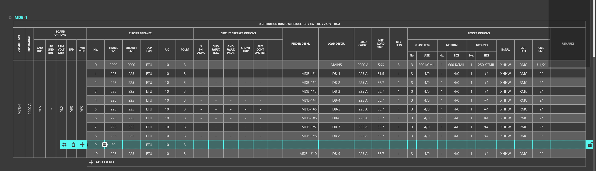

.. _Quick-Start-Guide:

**Welcome to THRUX!**

Use this guide to help set up your projects and navigate to common tasks.  

Supplement this with our :ref:`User Manual <User-Manual>` and our :ref:`FAQ's <Frequently-Asked-Questions>` for more information.

**Creating a New Project**
==========================

On the Home Screen, use the + button to create a new project.

Enter a name for your project and select Start to load all of the default settings.  These settings can be modified at any time.

**Defining Architectural Elements**
===================================

The goal of the Architectural Workspaces, Arch. Elements and Floor Plans, is to provide a quick way for designers to mass the load of a building.  They aid with point-to-point calculations.

However, these workspaces are completely optional.  For a smaller project, you may not find it necessary to set up these workspaces, and find it faster to manually input feeder lengths in the :ref:`One-Line <One-Line>`.

Soon, this information will be imported from an Architectural Revit model.

Open the Floor Plans workspace by clicking on the icon on the left.

A blank screen will be displayed because no Architectural Elements have been defined.

Creating Columns, Floors, and Rooms
-----------------------------------

Use the Setup Wizard on the right to start to create columns and floors.  Think of this as a skeleton to base your equipment locations.

In this example, we've created a 100 ft. by 100 ft. building which is 100 ft. tall.

Use the Grid Editor to modify columns, and Accept Changes when complete.

Create a Room by hovering over a column region.  We'll create a Utility Room or a service entrance room.

Create stacked Rooms in a common location as the building rises, by selecting multiple Floors, and adding a Room.  We'll create an electrical closet which spans the selected floors.

Similarly, while multiple floors are selected, create a Riser, which is a space dedicated for pipes to route between distribution nodes.

We'll also create a room for a generator on the top Floor.

.. image:: images/floorplans-room-6.PNG
    :align: center

Now we have some base locations to place our equipment.  These Architectural Elements can be modified at any time in the :ref:`Arch. Elements <Arch.-Elements>` workspace.

Here, you can modify other characteristics of a Floor.  For example, to mass the load of a building, we can assign a load requirement or load density to each floor.  This load is based off of the Floor's Space Type.

The Space Types are customizable, and a set of default values are provided.  

Massing the Building Load
-------------------------

Now, we'll package all of the Architectural entities to calculate the load of the project.

Select all of the Floors and create a Package.

In addition to our Floor loads, we must account for the power requirements of mechanical equipment.  We can do this by modifying the Space Type, and also creating Load Allocation.

As an example, we're creating a Load Allocation which represents an AC Unit on each of the Office floors.

Add this Load Allocation to the Package we created earlier, by clicking the + button, and selecting the Package.

Switching back to the Arch. Package tab, we can see the total load of the building.

Now we're ready to build our electrical model.  Let's start in the :ref:`One-Line <One-Line>`.

**Building the One-Line**
=========================

Click the One-Line icon to open the workspace.  Power flow of your distribution system is shown from top to bottom.

Setup Wizard - Creating Equipment
---------------------------------

Use the Setup Wizard to Create a Source, Distribution Equipment, and Loads.  By default, the source voltage is 480 V.

Selected equipment will be denoted by a purple circle, with additional options to Add, Copy, Paste, Delete, and Navigate to other workspaces.

Rehosting Equipment
-------------------

To attach a load, to rehost, or to change the source of an equipment, you can drag and drop the load to its source.

Connect the rest of your distribution system.

Property Tags / Quick Views
---------------------------

Now that we have equipment, we can assign them Room locations.  To do this, we will use the Property Tags.

Open the Property Tags by clicking the label icon in the top toolbar.

Open the Property Tags by clicking the label icon in the top toolbar.

Under Quick Views, select Voltage Drop.

In addition, add the Room Property Tag, and note the One-Line.  Note the conductor arrangement has already been determined based on the Load Capacity. 

For each equipment, assign a Room by clicking in the textbox.

.. image:: images/one-line-property-tags-5.PNG
    :align: center

For the Distribution board we created, MDB-1, note the length before and after we assign it a Room location.

Manual Added Length
-------------------

Distances between equipment are determined by the Architectural Elements.  If a designer would like to account for additional length, use the Manual Added Length property.

Note the Voltage Drop values as the length is changed.

Deleting / Copying Equipment
----------------------------

Instead of feeding a single load, we're going to create a Distribution Board on each floor which serves the load of that floor.  

Delete the Package from MDB-1, by selecting it and clicking the Delete symbol.

Create a distribution board on each Floor of the building and attach its respective Floor Package.

Change the location of MDB-1 to be located in the Utility Entrance Room and refer to the image below.

Select the Distribution Board, DB-1, and use CTRL + C or the Copy Icon to copy the equipment.

.. image:: images/one-line-copy-3.PNG
    :align: center

The selection will highlight pink when it is copied to the clipboard.

Select MDB-1.  This will be the source of the copied equipment.

Use CTRL + V or the Paste Icon to paste the equipment.

Repeat this process for the rest of the building.  Refer to the image below.

Routing Through a Riser
-----------------------

To route equipment or to offset through a Riser, add the Riser Property Tag.  Then select the equipment to be routed through a Riser, and assign it a Riser. 

View Schedule
-------------

To view an equipment's schedule, select the equipment, and select View Schedule.

This opens the Schedules workspace.  Note that we forgot to add a distribution board for Floor 0.

**Schedules**
=============

The :ref:`Schedules <Schedules>` are a tabular representation of your distribution system.

Copying, Deleting, and Moving Equipment in the Schedules workspace is similar to the interactions in the One-Line.

Moving / Rehosting Equipment
----------------------------

Select the Circuit Number #9 which feeds DB-9.  The selection will highlight cyan.

.. image:: images/schedules-moving-equipment-1.PNG
    :align: center

Use the grip to drag and drop the circuit from Circuit Number #9 to Circuit Number #10.

Repeat this until Circuit Number #1 is available.

Copying Equipment / Cutting Equipment
-------------------------------------

Select the Circuit Number #2 which feeds DB-1.  The selection will highlight cyan.

Use CTRL + C  or CTRL + X to copy or cut the equipment.  The selection will highlight purple.

Select the Circuit Number #1 and use CTRL + V to paste the equipment.  

Scope to One-Line
-----------------

While Circuit Number #1 is selected, change DB-1 to DB-0.  The cyan selection represents a circuit.  Right-click anywhere inside the cyan region.  Select Scope to One-Line.

Here, we can assign the correct Floor Package to DB-0 using the Property Explorer, which is used to modify additional properties.

Select the F1 Package and select Edit, which will bring up the Properties Explorer.  Change the name to F0 and change the Package to F0.

Adding OCPD's
-------------
By default, distribution equipment are given 10 spaces for protective devices.  Equipment cannot be added if there is no space for a protective device.

To add an OCPD, select ADD OCPD at the bottom of the schedule.

Adding / Deleting Equipment
---------------------------

While an equipment is selected, note the Add (+ icon) button or Delete (Trash icon) Equipment button.

Exporting Schedules
-------------------

Schedules can be exported to .csv or .dwg by using the Export button.

**Reporting**
=============

Studies, Pricing Report, and the PriceTracker are a few of the other reporting workspaces.

Studies allows a tabular view of common engineering reports of the model such as Voltage Drop, Short Circuit, and Loading.

Pricing Report allows the user to see a breakout of OOM estimates for the model.

The PriceTracker is a tool which monitors the price of the model live.

.. image:: images/pricetracker-icon.PNG
    :align: center

Similarly, the FlagTracker is a tool which reports any violations of any applicable codes and safety standards.

The Issuance Log is a tool which allows the designer to create branches of their design.  Changes between branches can be monitored and compared using the ChangeTracking Workspace.

The :ref:`Codes Reference <Codes-Reference>` workspace allows the designer to view applicable reference tables to their model.

For a more complete guide, see our :ref:`User Manual<User-Manual>`