############
**One-Line**
############

The One-Line depicts power flow in a top-to-bottom sequence.  

Utility functions like navigation, or additional viewing properties can be found on the workspace toolbox at the top.  

Property Tags can be applied to assist with design or network visualization.

.. index:: How to Create a Source

.. _One-Line-Adding-A-Source:

Add a Source
============

Use the Setup Wizard to Create Source, or Right-click inside the workspace and click Add Source, then click Utility Source. 

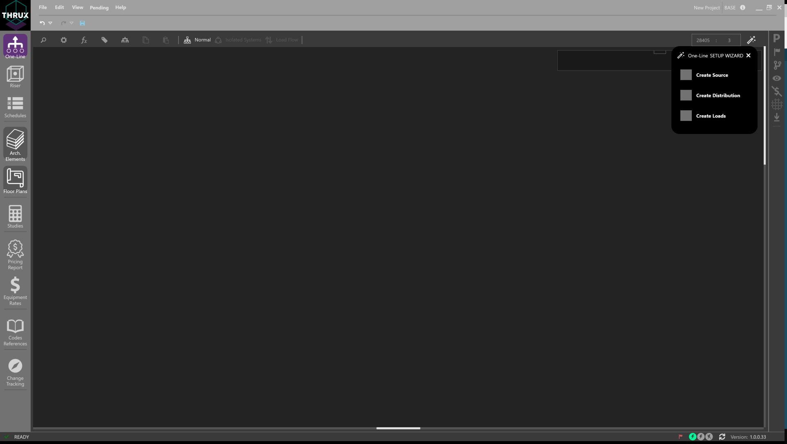

.. _One-Line-Adding-Equipment:

Add Equipment
=============

Click on the Utility and the Selection Dial will display a ring of options.  Click the + button to Add Equipment.

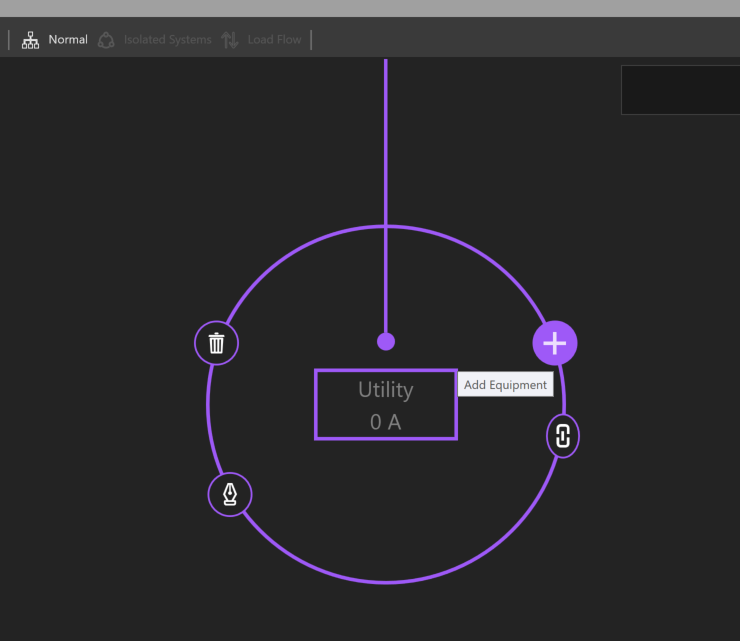

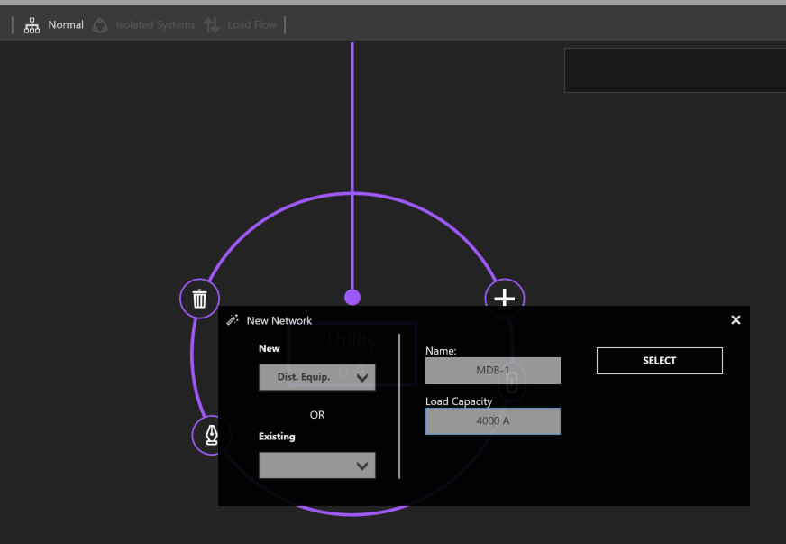

.. index:: How to Copy Equipment - One-Line

.. _One-Line-Copying-Equipment:

Copy / Paste Equipment
======================

To copy equipment, select the equipment.  Click Copy or use CTRL + C to copy. The selection will highlight pink and be added to the clipboard.  

.. image:: images/one-line-copy_equipment.PNG

Then, select the source or equipment to paste to, and click Paste or use CTRL+V.

.. image:: images/one-line-paste_equipment.PNG

Delete Equipment / Delete Network
=================================

To delete equipment, select the equipment.  Then Click Delete (trash symbol) or use DEL to delete. 

.. image:: images/one-line-delete_equipment.PNG

If the selected equipment is feeding downstream equipment, you can either delete the selected equipment, or the entire network.

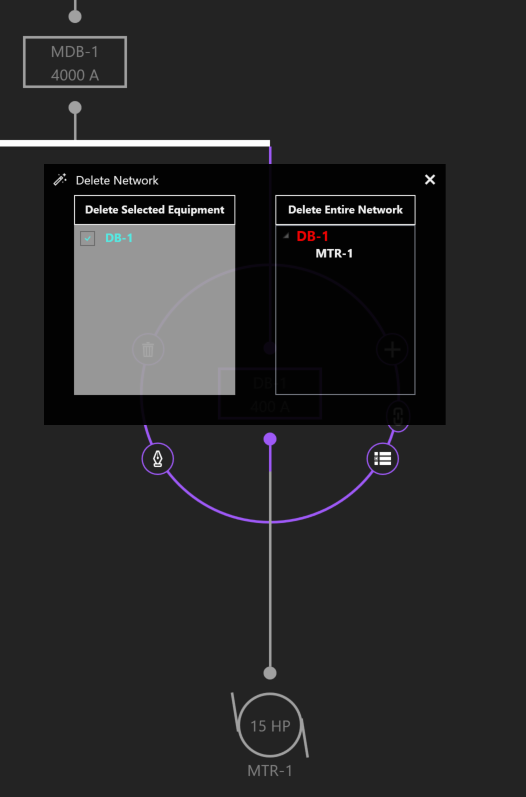

.. _One-Line-Rehosting:

Dragging / Rehosting Equipment
==============================

To redirect an equipment's source, click and drag the equipment from its current source, to a different source.

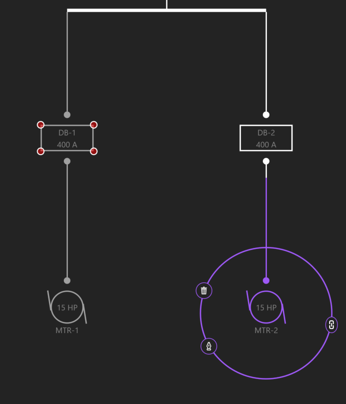

Navigate
========

Navigate grants the ability to jump between workspaces based on the current selection.

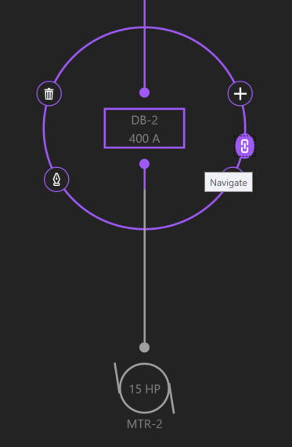

A designer can view an equipment's schedule, location on the Riser, location on the Floor Plans, or the Studies workspace.

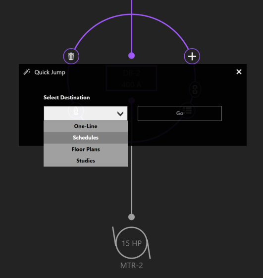

View Schedule
=============

To view to an equipment's schedule, select the equipment, and then click View Schedule.

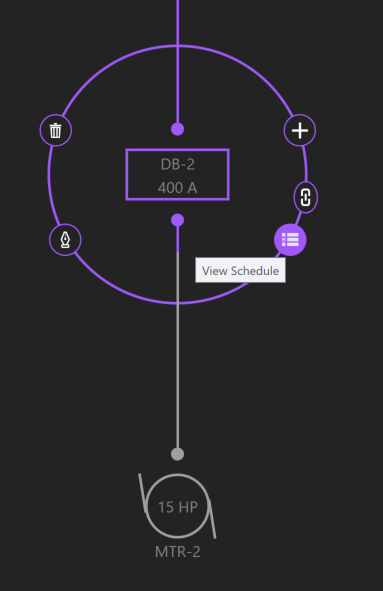

Searching
=========

To search for equipment, click the magnifying glass in the top left.  Start to type the name of the equipment you are searching for.  Select the equipment, and the workspace will navigate to the associated equipment.

.. image:: images/one-line-searching.PNG

Settings
========

Toggle the visibility settings of OCPD's by hitting Show OCPD.

.. image:: images/one-line-ocpd_settings.PNG

Load Calculations
=================

Normal
------

Calculations are based on the Net Load.

Board Capacity
--------------

Calculations are based on the capacity of the board.

Load Override
-------------

Calculations are based on the Load Override value.  For example, if a designer wants to model a specific loading scenario between points in their distribution system, enter these loading values into Load Override.

Property Tags / Quick Views
===========================

Use Property Tags to view and edit specific elements of your design.  Click the tag symbol in the upper left of the workspace toolbar.  

Quick Views are preset property groupings such as Voltage Drop, Loading, Load Diversification, and Circuit Routing. 

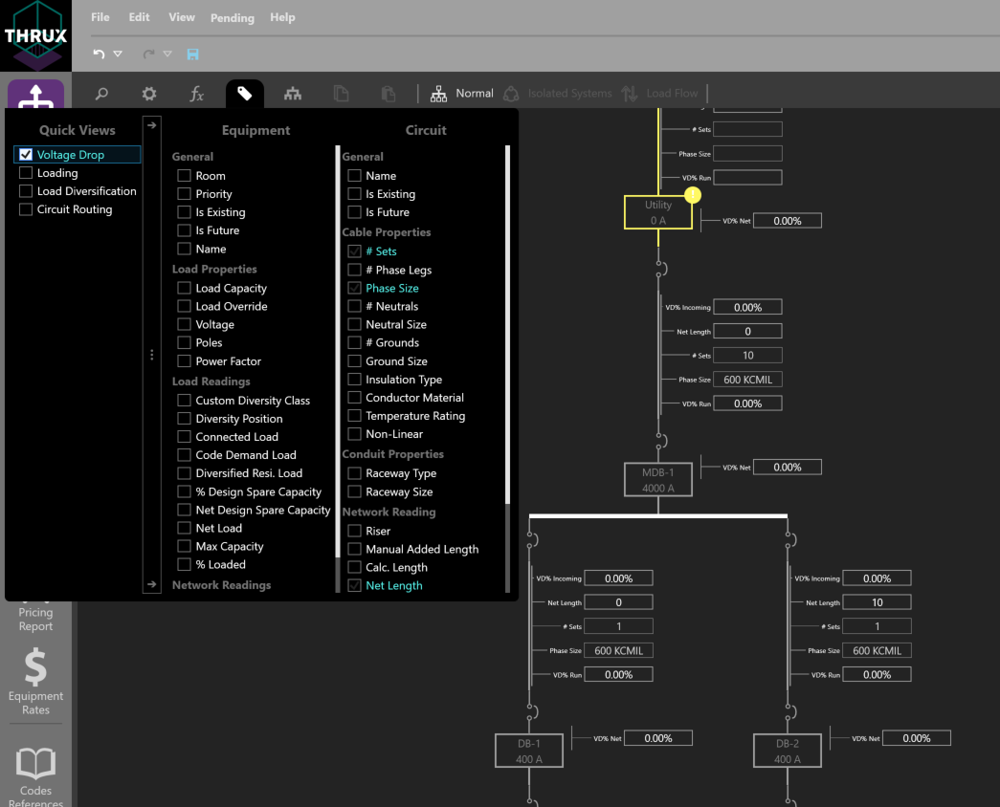

Expanding / Collapsing Equipment
================================

Sections of the distribution network can be expanded or collapsed on an individual or group basis.  An alternative to expanding equipment is by double-clicking on the node.

.. image:: images/one-line-expand_collapse.PNG

One-Line View Selectors
=======================

Different Views can be applied to aid the designer.  

By default, Normal is selected.  

Isolated Systems is recommended when viewing transfer switches.  The designer can study voltage drop as a switch is fed from different sources.

Load Flow is recommended when studying how a system is loaded.

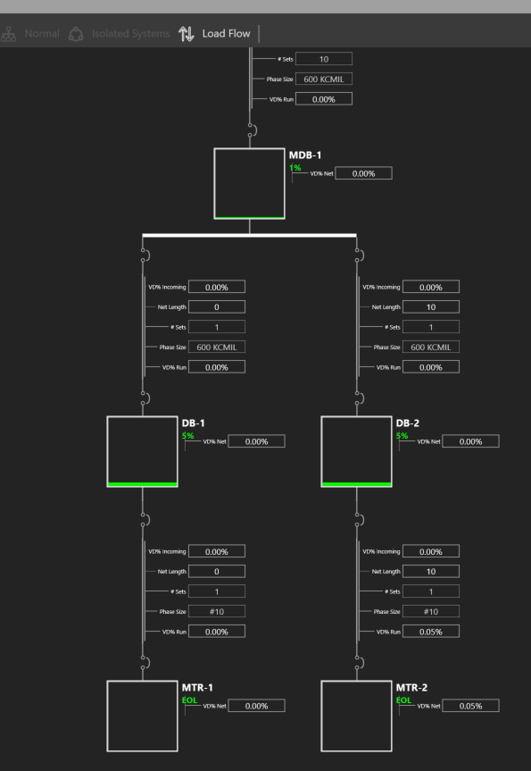

.. _One-Line-Transfer_Switch:

Creating a Transfer Switch
==========================

Transfer switches are connected to a primary and secondary source of power.  To create a transfer switch, click Add Equipment, and choose ATS/STS.

.. image:: images/one-line-transfer_switch_1.PNG

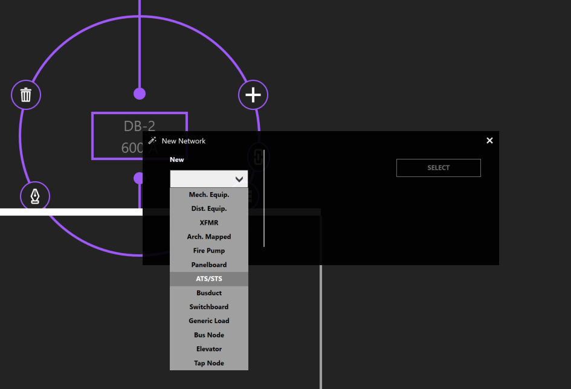

To connect the secondary source of power, choose another distribution equipment.  Then click Add Equipment, and select an ATS/STS from the Existing dropdown menu.

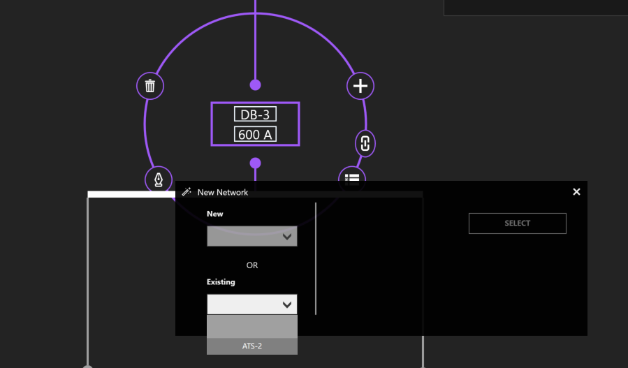

.. _One-Line-Bus_Duct:

How do I create a bus duct?
===========================

Select an equipment.  Then select Add Equipment to create a bus duct.  

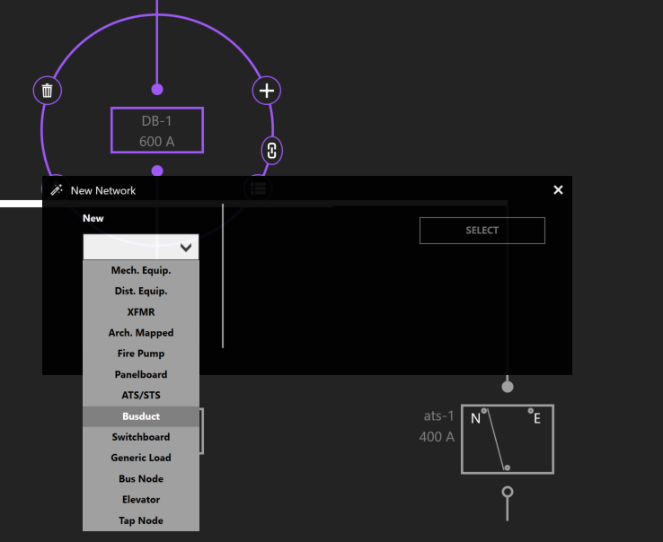
