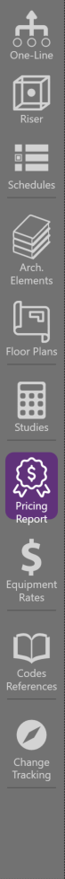
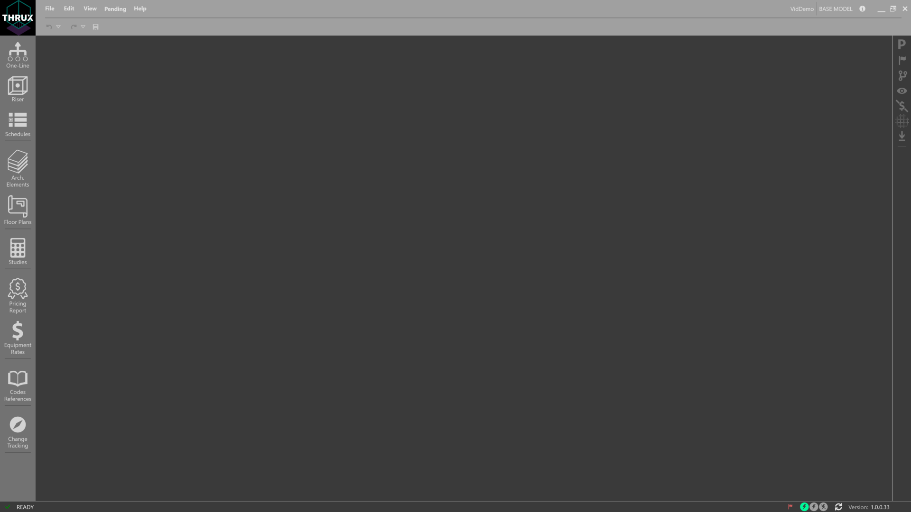

**Explorers / Utility Design Tools**
====================================

The right side of THRUX is generally where the explorers or utility functions are located.  Explorers can be pinned to always be visible, while other explorers are being used.

.. toctree::
    :maxdepth: 2

    propertiesexplorer/index-properties_explorer
    flagtracker/index-flag_tracker
    issuancelog/index-issuance_log
    cascademonitor/index-cascade_monitor
    pricetracker/index-price_tracker
    scenariomanager/index-scenario_manager
    dataexporter/index-data_exporter
    studies/index-studies
    pricingreport/index-pricing_report
    equipmentrates/index-equipment_rates
    codesreference/index-codes_reference
    changetracking/index-change_tracking
    statusbar/index-status_bar

:doc:`propertiesexplorer/index-properties_explorer`
    The Properties Explorer presents properties of the current selection.

.. image:: images/properties_explorer.PNG

:doc:`flagtracker/index-flag_tracker`
    The FlagTracker live monitors flags and errors in your design.

.. image:: images/flag_tracker.PNG

:doc:`issuancelog/index-issuance_log`
    The Issuance Log allows you to create branches off of your design.  A diagram displaying the branch history is shown in the bottom right.

.. image:: images/issuance_log.PNG

:doc:`cascademonitor/index-cascade_monitor`
    The Cascade Monitor allows the designer to view the cascading effects of changes to their design in a line-item format.

.. image:: images/cascade_monitor.PNG

:doc:`pricetracker/index-price_tracker`
    The Price Tracker live monitors the price of your design.  This can be further expanded by viewing the Pricing Report workspace.

:doc:`scenariomanager/index-scenario_manager`
    The Scenario Manager allows the designer to create different scenarios which toggle the state of specific protective devices.

:doc:`dataexporter/index-data_exporter`
    The Data Exporter allows the designer to export their data model in .csv, .xml, or .json.

:doc:`studies/index-studies`
    Studies is a reporting workspace for technical studies of the project.

:doc:`pricingreport/index-pricing_report`
    Pricing Report is a reporting workspace for the OOM estimates of the project.

:doc:`equipmentrates/index-equipment_rates`
    Equipment Rates is a customizable catalog which compose the bid for materials.

.. image:: images/equipment_rates.PNG

:doc:`codesreference/index-codes_reference`
    Codes Reference is a reference workspace for safety codes and standards.

:doc:`changetracking/index-change_tracking`
    Change Tracking allows designers to compare branches of issuances.

:doc:`statusbar/index-status_bar`
    The Status Bar is located at the bottom of THRUX.  It indicates different states of THRUX, and provides other utility functions.

