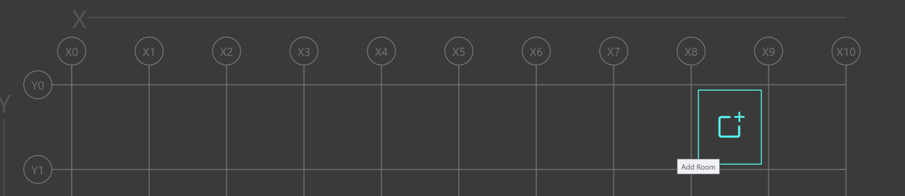

**Defining Architectural Elements**
===================================

.. toctree::
    :maxdepth: 2
    :hidden:

    archelements/index-arch_elements

*******************************************************************************************************************************************************************************************************************************************************************************************

The :doc:`archelements/index-arch_elements` are the spacial elements which give engineers a base for their point to point calculations.  

For example, voltage drop is a calculation based on the electrical load, and the distance between the source and the load.

These elements can be created in the Floor Plans workspace, or the Architectural Elements workspace.

.. _Floor-Plans-Overview:

Floor Plans
-----------

Floor Plans are a 2-D representation of your project.  Designers can create columns and floors to build a skeleton or framework.  This skeleton can be used to model locations of equipment.  

As the architect modifies their design by changing equipment locations, THRUX designers can quickly adapt to these changes, while verifing the integrity of their design.
        
Setup Wizard
------------

Use the Setup Wizard to create the columns and floors of your project.

.. image:: images/setup_wizard.PNG
    :align: center

You can create multiple columns and floors at a time by specifying a distance in between each.  These can be individually modified in Architectural Elements.

.. image:: images/column_creator.PNG
    :align: center

Cycle through floors by selecting the floor on the left side bar.

.. image:: images/floor_selection.PNG
    :align: center

Grid Editor
-----------

Use the Grid Editor to modify the spacing in between columns.

Creating Rooms
--------------

Once floors are created, create a room by hovering your mouse between column regions, and clicking Add Room.  

To create a room in a common location spanning multiple floors, use Shift+Click to select multiple floors, and then hover over a grid region to click Add Room.

Risers
------

Risers are shafts or spaces which are designated for groups of pipes to route to and from distribution equipment.

Therefore, instead of routing directly from a distribution equipment to a load, the route can offset through a riser shaft before terminating at the load.

To create a Riser, in the Floor Plans workspace, select a group of floors which the riser will span.  Use Shift+Click to multi-select.  Then hover over a grid region, and select Add Riser.  This can also be modified in Architectural Elements.

.. image:: images/riser.PNG
    :align: center

Moving Rooms / Risers
---------------------

Once rooms or risers are created, move a room or riser by clicking and dragging it to the new region.

Conduit Lengths
---------------

Conduit lengths are determined by a starting location, and an ending location.  

The Calculated Length, or orthogonal route, between two pieces of equipment is determined by their Room locations.  A designer can modify the Manual Added Length to account for additional distance.

.. image:: images/conduit_lengths_2.PNG
    :align: center

In addition, if the conduits are being routed through a riser shaft, assign a Riser to the terminating equipment.

Load Packages
-------------

Load Packages are used to model power densities of a group of elements.  

For example, a group of floors could each have their SpaceType designated as Office, which has a specific power density.  This group of floors can be packaged as a load, and fed from a distribution equipment.

To create a Load Package, within Architectural Elements, select a group of Floors, or Rooms.  In the orange textbox, enter a name for the Load Package, and then click the (+) button.  To view your Load Packages, click the Arch. Package tab.

.. image:: images/create_package.PNG
    :align: center

Load Allocations
----------------

In addition to floor or room power densities, power can be allocated to specific floors.

For example, if a designer is in the process of massing loads, and wants to assign a 15 HP load to each Office Floor, create a Load Allocation, and use the (+) button to assign it to each Floor of the Office Space Type.

.. image:: images/load_allocation.PNG
    :align: center
