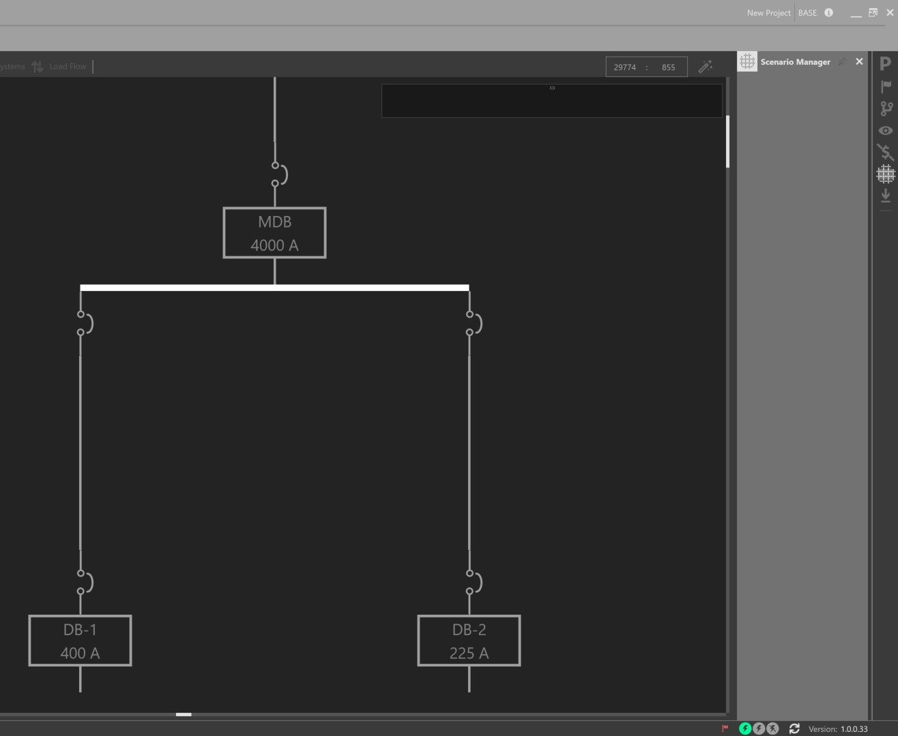

Scenario Manager
----------------

The Scenario Manager can be used to model different scenarios representing the state of protective devices.  It is generally used in conjunction with the One-Line.

For example, a designer may want to perform a load flow study of their electrical system as certain protective devices are opened or closed.

Open the Scenario Manager and show the OCPDs on the One-Line.

Right-click on a protective device to add it to a New Scenario.

.. image:: images/scenario_manager_2.PNG

.. image:: images/scenario_manager_3.PNG

In each Scenario, toggle the different states of protective devices, and also toggle between different Scenarios as shown below.

.. image:: images/scenario_manager_4.PNG

.. image:: images/scenario_manager_5.PNG
